 

## Who I Am

Final-year IET student at Foundation University, focused on full-stack web & mobile development and AI-driven systems. I've developed projects across web apps, CLI tools, and AI/computer vision.

**Open to:** Software Development Roles · Full-Stack Projects · AI/ML Integration · Collaboration

 

## Featured: SecureVision — My FYP

<table>
<tr>
<td>

**AI-Powered CCTV Surveillance System ** · 2025–2026 · Built in partnership with **K-Soft**

Real-time human detection across multiple live camera feeds, plus face-recognition-based video search — replacing manual healthcare monitoring with automated, searchable surveillance.

 

&nbsp;
&nbsp;
&nbsp;
&nbsp;

</td>
</tr>
</table>

 

## Other Projects

<b>Click to expand / collapse</b>

 

| Project | Description | Stack |
|---|---|---|
| [Movie Reservation System](https://github.com/Shayyann7823/AureumMovieReservationSystem) | Fetches live movie listings via API — browse showtimes, select seats, and book tickets online. | ASP.NET Core MVC, C# |
| [Biryani Time](https://github.com/Shayyann7823/BiryaniTime) | Full-featured food ordering web app for a Karachi-style biryani restaurant. | Next.js 14, React, Tailwind, TypeScript |
| [House of Aura](https://github.com/Shayyann7823/Clothingstore) | Full-stack clothing e-commerce platform with an AI-powered stylist chatbot, cart, favorites, and secure auth. | Next.js, React, TypeScript |
| [Doctors Appointment Scheduler](https://github.com/Shayyann7823/Doctors_Appointment_Scheduler) | CLI app to view doctor availability, book real-time appointments, and process payments. | C++ |
| [Extra Class Scheduler](https://github.com/Shayyann7823/Makeup-Classes-Scheduler) | Web system for Foundation University letting teachers book makeup classes with real-time, department-wise timetables. | HTML, CSS, JavaScript |
| [Student Enrollment System](https://github.com/Shayyann7823/Student-Enrollment-System) | Add, view, search, update, and delete student records using arrays and functions. | C++ |
| [HandyDrive](https://github.com/Shayyann7823/HandyDrive) | Real-time hand-gesture recognition system using MediaPipe hand landmark detection — custom finger-counting and fist-detection logic mapped to simulated keyboard input to control racing/driving games. | Python, MediaPipe, PyDirectInput |

 

## Tech Stack

<b>Programming Languages</b>

 

| C++ | Python | C# | PHP | HTML | CSS | JavaScript | TypeScript |
|:---:|:---:|:---:|:---:|:---:|:---:|:---:|:---:|
|  |  |  |  |  |  |  |  |

<b>Frameworks</b>

 

| React Native | ASP.NET Core | Next.js | React |
|:---:|:---:|:---:|:---:|
|  |  |  |  |

<b>Libraries</b>

 

| Pandas | NumPy | Scikit-learn | Matplotlib | Tailwind CSS | Zustand | Prisma ORM |
|:---:|:---:|:---:|:---:|:---:|:---:|:---:|
|  |  |  |  |  |  |  |

<b>Databases & Networking</b>

 

| MongoDB | MS SQL Server | Cisco Packet Tracer | PostgreSQL |
|:---:|:---:|:---:|:---:|
|  |  |  |  |

<b>Cybersecurity Tools</b>

 

| Kali Linux | Metasploit Framework | Metasploitable | VMware | MS Threat Modeling Tool |
|:---:|:---:|:---:|:---:|:---:|
|  |  |  |  |  |

<b>Dev Tools</b>

 

| Visual Studio | VS Code | Jupyter Notebook |
|:---:|:---:|:---:|
|  |  |  |

 

## GitHub Stats

 

## Reach Out

